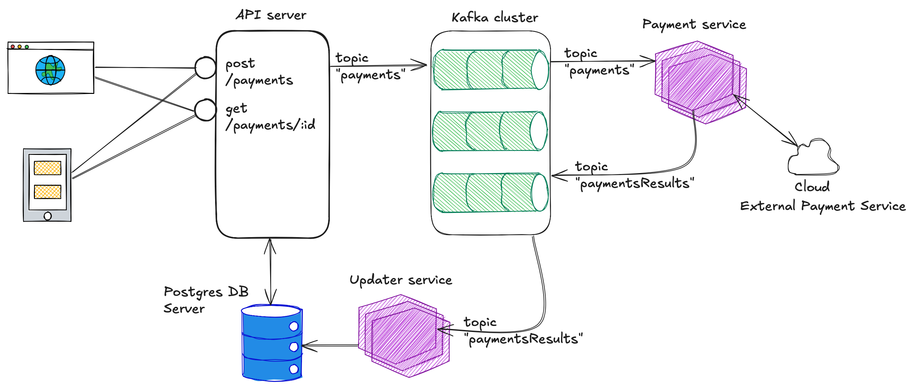

# Payment Pet API

## Table of Contents

- [About](#about)
- [Getting Started](#getting_started)
- [To Do](#todo)

## About <a name = "about"></a>

Создает композитный контейнер c набором сервисов, имитирующих проведение платежа. В своем роде это обучающий стэнд, показывающий как можно комбинировать Frontend, REST, Kafka и DB Postgres. Код не идеален, написан на скорую руку, отчасти с помощью AI. Прошу не судить строго :)

### Архитектура


### Компоненты
- nextjs-app: веб интерфейс http://localhost:4000/ (React app на базе фреймворка Next.js, платеж создается методом POST на сервис main-api, результат запрашивается стратегией long pooling)
- db: база данных postgres (открыта извне контейнера по порту 35432, юзер postgres пароль example. можно подключиться к localhost с помощью PGAdmin или подобными программами)
- kafka: брокер кафки (один брокер в режиме Kraft, без зуукипера)
- kafka-ui: веб интерфейс для кафки от provectuslabs http://localhost:8080/ здесь можно в режиме реалтайм наблюдать за топиками и сообщениями в них
- kafka-init: компонент инициализации кафки (создает топики. 2 топика. входящие платежи и результаты обработки платежей, соответственно payments и paymentsResults. по 3 партиции в каждом)
- main-api: основной API service для приема запросов от веб и мобильных клиентов (записывает новые платежи в БД и помещает в топик payments, извне контейнера доступен http://localhost:8010/ можно постманом подергать ручки, также доступна OpenAPI спецификация http://localhost:8010/docs)
- payment-service: микросервис обработки платежа (берет входящие платежи из топика payments и внутри себя имитирует запрос во внешнюю систему платежей и дает успешный результат с вероятностью 80%, соответственно остальная вероятность это отказ в платеже. сервис дает результат спустя рандомную задержку, до 25 сек. результат кладет в топик результатов платежей paymentsResults)
- updater-service: микросервис обработки результатов платежа из топика paymentsResults и обновления данных платежа в БД (извне контейнера доступен http://localhost:8011/ там только корневой ендпойт для проверки здоровья :)

### Postman collection
Здесь указаны все ручки main-api. Также с помощью постмана можно нагрузочное тестирование устроить, запуская postman runner.

[](https://app.getpostman.com/run-collection/15342782-f1b44bdd-3c15-45a9-a259-0e164f49a6da?action=collection%2Ffork&source=rip_markdown&collection-url=entityId%3D15342782-f1b44bdd-3c15-45a9-a259-0e164f49a6da%26entityType%3Dcollection%26workspaceId%3D68c07b05-7bae-4c01-9e65-523859c05585)


## Getting Started <a name = "getting_started"></a>

### Prerequisites

Вам нужен установленный докер и гит.

### Installing

```
git clone https://github.com/maxikoro/paymentAPI.git
cd paymentAPI
docker compose up -d
```
Первый раз билд может длиться довольно долго. Не пугайтесь. Веб интерфейс на основе Next.js особенно долго собирается.

### Если есть проблема с билдом питон контейнеров на внешнем хостинге, то вот решение:
The reason for this is issue is an MTU mismatch of your network interfaces. If you open the base image from your Dockerfile in interactive mode: sudo docker run -it {your base image repo} /bin/bash, and run ip a, then do the same on your host OS, you will probably find that they are different. This means that the Docker bridge is dropping packets / failing transmission. If you want bridge networking to work as opposed to host, create a file on your host OS at /etc/docker/daemon.json with the contents
```
{
    "mtu": whatever_your_host_os_MTU_is
}
```
and then run sudo systemctl restart docker, this should probably fix your bridge networking.


## To Do <a name = "todo"></a>
- Рефакторинг инициализации кафки(сейчас иногда она не успевает стартануть, не успевают создаться топики и сервисы валятся. Правда их можно отдельно зарестартить и вопрос решен :)
- Сделать кластер брокеров кафки(сейчас там один брокер, он же контроллер в режиме Kraft, без зуукипера) и поэксперементировать с отказами и последующей ребалансировкой
- Дед леттер кью(для полной картины надо имитировать, что некоторые платежи сразу не обрабатываются и продумать логику для этого)
- можно масштабировать микросервисы payment-service, updater-service.(просто накопировать их в докер-композе.ямл) Сейчас они по одному, можно увеличить до количества партиций в топиках(до 3)
